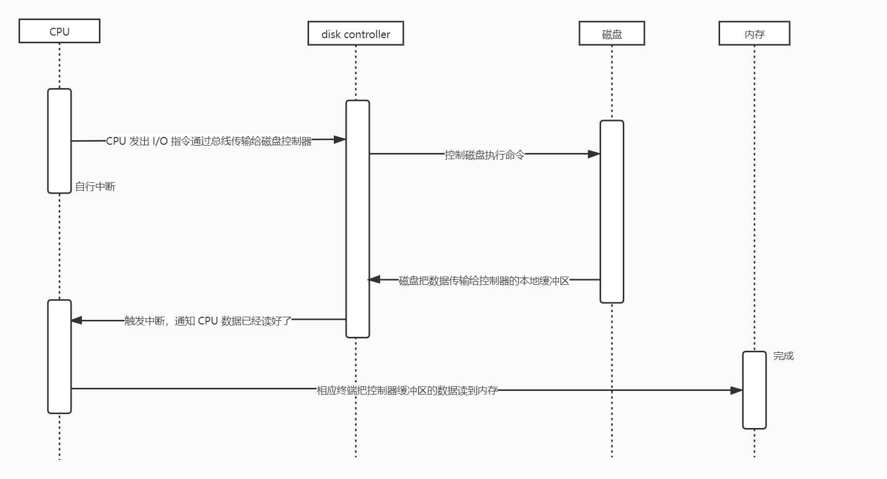

# OS（Operating System）

## 现代计算机系统组成
- 一个或多个 CPU（或核）和内存
- 若干通过总线简介的设备控制器和 I/O 设备
- 总线

CPU 可以从内存读取指令和数据，并执行指令，也就是运行程序。而各个 I/O 设备，则由各自的控制器控制，如，磁盘通过磁盘控制器控制读写磁盘。每一个控制器是一个小型专用的处理器，控制相应的设备运行。CPU 和设备控制器可并行工作，并竞争内存。 

CPU 通过设备控制器控制设备运行的过程举例：**从磁盘读数据为例，演示 CPU 和磁盘的写作过程**  
每个控制器都有一个本地缓存；  
CPU 可以在内存和控制器的本地缓存之间传输数据；  
控制器可以在设备和设备的本地缓存之前传输数据。  

**注：** CPU 和磁盘控制器可以并行工作的，也就是说磁盘控制器在读入数据的同时，CPU 可以同时执行指令。

## 中断驱动
`中断` 是指当出现需要时，CPU 暂时停止当前进程的执行，转而执行处理新情况的中断处理程序，当执行完中断处理程序后，则重新从刚才停下的位置继续当前进程的执行。

// todo https://www.bilibili.com/video/BV1JJ411S7S7?p=1