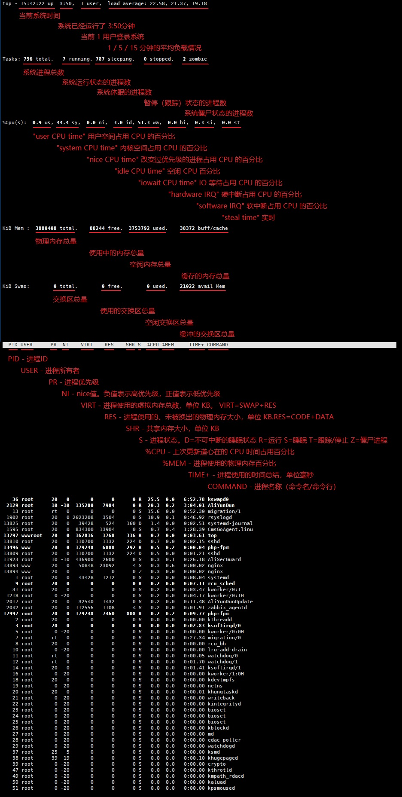

# TOP 命令

实时显示 process 的动态

### 语法
```sh
top [-] [d delay] [q] [c] [S] [s] [i] [n] [b]
```

### 参数说明
- d : 改变显示的更新速度，或是在交谈式指令列( interactive command)按 s  
- q : 没有任何延迟的显示速度，如果使用者是有 superuser 的权限，则 top 将会以最高的优先序执行  
- c : 切换显示模式，共有两种模式，一是只显示执行档的名称，另一种是显示完整的路径与名称S : 累积模式，会将己完成或消失的子行程 ( dead child process ) 的 CPU time 累积起来  
- s : 安全模式，将交谈式指令取消, 避免潜在的危机  
- i : 不显示任何闲置 (idle) 或无用 (zombie) 的行程  
- n : 更新的次数，完成后将会退出 top  
- b : 批次档模式，搭配 "n" 参数一起使用，可以用来将 top 的结果输出到档案内  
> 除了 `d`、`c`、`p` 以外，都没什么用：
```sh
top -d 2  # 每隔2秒显式所有进程的资源占用情况
top -c  # 每隔5秒显式进程的资源占用情况，并显示进程的命令行参数(默认只有进程名)
top -p 12345 -p 6789 # 每隔5秒显示pid是12345和pid是6789的两个进程的资源占用情况
top -d 2 -c -p 123456 # 每隔2秒显示pid是12345的进程的资源使用情况，并显式该进程启动的命令行参数
```

### top工具的内置命令或交互命令的使用
top命令执行过程中可以使用的一些交互命令。
- f ： 选择显示或隐藏对应的列的内容，进入后按 a-z 即可显示或隐藏
- o：  可以改变列的显示顺序，进入后按小写的 a-z 可以将相应的列向右移动，而大写的 A-Z  可以将相应的列向左移动。最后按回车键确定。
- F或O： 进入后按 a-z 可以将进程按照相应的列进行排序，选定排序列按回车键退出之后还可以按R对当前选定列进行排序倒转。
- k ： 终止一个进程。系统将提示用户输入需要终止的进程 PID，以及需要发送给该进程什么样的信号。一般的终止进程可以使用 15 信号；如果不能正常结束那就使用信号9强制结束该进程。默认值是信号 15。在安全模式中此命令被屏蔽
- i：  忽略闲置和僵死进程。这是一个开关式命令
- q：  退出程序
- S：  切换到累计模式。
- s :  改变两次刷新之间的延迟时间。系统将提示用户输入新的时间，单位为 s。如果有小数，就换算成 ms。输入 0 值则系统将不断刷新，默认值是 5s。需要注意的是如果设置太小的时间，很可能会引起不断刷新，从而根本来不及看清显示的情况，而且系统负载也会大大增加
- r：  重新安排一个进程的优先级别。系统提示用户输入需要改变的进程PID以及需要设置的进程优先级值。输入一个正值将使优先级降低，反之则可以使该进程拥有更高的优先权。默认值是 10。
- l: 　切换显示平均负载和启动时间信息。即显示影藏第一行
- m：  切换显示内存信息。即显示影藏内存行
- t ： 切换显示进程和 CPU 状态信息。即显示影藏 CPU 行
- c：  切换显示命令名称和完整命令行。 显示完整的命令。 这个功能很有用。
- M ： 根据驻留内存大小进行排序。
- P：  根据 CPU 使用百分比大小进行排序。
- T：  根据时间/累计时间进行排序。
- W：  将当前设置写入 ~/.toprc 文件中。这是写 top 配置文件的推荐方法

> 这些交互命令中有很多比较有用。  
```sh
1 # 监控每个逻辑CPU的状况
y # 关闭或打开 running 状态进程的高亮状态（top 命令会自动将 running 状态的进程高亮）
b # 切换高亮效果（加粗 / 变背景色）
shift + > # 向右变更排序列
shift + < # 向左变更排序列
x # 打开或关闭排序列的高亮效果
f # 进入另一个视图，前面带 * 的列，为被显示出来的列，← 或 → 选择或取消选择列，↑ 或 ↓ 调整列的顺序。
```

### top 默认显示内容详细标注

