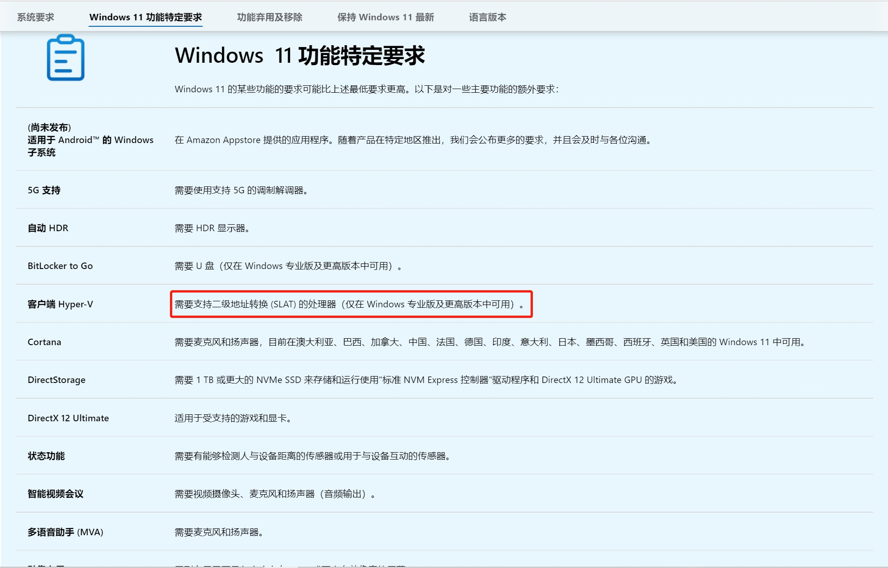

# SLAT

[概念](../../../concept/quick-search/s/slat.md)

系统提示升级 Windows11 时，查看 [系统要求](https://www.microsoft.com/zh-cn/windows/windows-11-specifications#primaryR3) 信息，发现 windows11 的 Hyper-v 需要 CPU 支持 SLAT 技术。  
但是 SLAT 技术需要专业版或更高版本。   


于是了解 SLAT 技术概念

## 什么是 SLAT
在程序访问内存时都要经过从 [逻辑地址]() 到 [物理地址]() 的映射，虚拟环境下也不例外反而更加复杂，因为第一次映射出来的“物理地址”**还是**虚拟机下的虚拟地址，需要通过虚拟机把它再次映射成实际的物理地址，这样就限制了访问的速度。 而 SLAT 即“二级地址转换”，可以加速页表访问的速度！在 Intel 和 AMD 处理器上都提供了这一新技术，两个品牌针对 SLAT 这一技术有不同的技术名称：   
- Intel 的 SLAT 称为 `EPT`（Extended Page Table，扩展页表），Intel 的 Core i7（但是我的笔记本是 'Intel(R) Core(TM) i7-10510U CPU @ 1.80GHz   2.30 GHz'，也不支持），i5，i3，Pentium G6950 以及大部分的 Xeons 处理器都支持 SLAT，而 Core 2 系列以及更早的处理器则不支持！
- AMD 的 SLAT 称为 `RVI`（Rapid Virtualzation Indexing，快速虚拟化索引），第三代皓龙处理器（代号：巴塞罗那）都支持这一技术。   

// todo 学习 逻辑地址、物理地址 相关概念

## 检查是否支持 SLAT
微软提供一个工具：`Coreinfo`，检测是否支持二级地址转换。[下载](https://download.sysinternals.com/files/Coreinfo.zip)地址。
解压后，以管理员身份运行 cmd，执行命令：
```cmd
rem “`*`” 表示支持，“`-`” 表示不支持。
rem 结果显示 EPT 为 “-”，不支持
D:\Downloads\Coreinfo> Coreinfo.exe -v

Coreinfo v3.52 - Dump information on system CPU and memory topology
Copyright (C) 2008-2021 Mark Russinovich
Sysinternals - www.sysinternals.com

Note: Coreinfo must be executed on a system without a hypervisor running for
accurate results.

Intel(R) Core(TM) i7-10510U CPU @ 1.80GHz
Intel64 Family 6 Model 142 Stepping 12, GenuineIntel
Microcode signature: 000000DE
HYPERVISOR      *       Hypervisor is present
VMX             -       Supports Intel hardware-assisted virtualization
EPT             -       Supports Intel extended page tables (SLAT)
URG             -       Supports Intel unrestricted guest
```

## 我的 Hyper-v
我的家庭版 Windows10，也没有 Hyper-v 选项，是通过命令行的方式[添加](../../../ops/hyper-v/hyper-v.md)的 Hyper-v 虚拟机。
检查后发现 CPU 不支持 SLAT，但是也可以使用 Hyper-v，原因见下一节《**SLAT 不是必须的**》。

## SLAT 不是必须的
摘自参考 1：

首先看看 `Windows server8` 中 hyper-V 对硬件的需求：（hyper-v3.0）   
- **支持虚拟化扩展的处理器**（必选）：   
在 BIOS 内启用基于硬件的虚拟化扩展，允许虚拟机直接与处理器进行交互，这将提升 Type 2 hypervisor（Oracle VirtualBox，Virtual PC） 的性能。自从Hyper-V RTM 在 2008 年发布以来，一直要求处理器支持虚拟化扩展。启用处理器虚拟化（处理器虚拟化默认通常是禁用的），在服务器或工作站上打开 BIOS，然后查找高级处理器选项并启用处理器虚拟化。
- **启用处理器 DEP**（必选）：   
和处理器虚拟化类似，自从 Hyper-V RTM 发布以来，数据执行保护（DEP）也是必须启用的处理器配置。DEP避免了在内存中执行可能会有害的代码。
- **启用处理器SLAT**（**`可选`**）：该技术允许虚拟机以更加高效的方式访问物理内存。对于二级地址转换（SLAT）也称为扩展页面表或者是嵌套页面表是否是 Hyper-V 3.0 的必选项说法不一。   

接着是 `Windows8` 客户端版本：
- **支持虚拟化扩展的处理器**（必选）：在 BIOS 内启用基于硬件的虚拟化扩展，允许虚拟机直接与处理器进行交互，这将提升 Type 2 hypervisor（Oracle VirtualBox，Virtual PC）的性能。自从 Hyper-V RTM 在 2008 年发布以来，一直要求处理器支持虚拟化扩展。   
启用处理器虚拟化（处理器虚拟化默认通常是禁用的），在服务器或工作站上打开 BIOS，然后查找高级处理器选项并启用处理器虚拟化。
- **启用处理器 DEP**（必选）：和处理器虚拟化类似，自从 Hyper-V RTM 发布以来，数据执行保护（DEP）也是必须启用的处理器配置。DEP 避免了在内存中执行可能会有害的代码。
- **启用处理器SLAT**（**`必选`**）：该技术允许虚拟机以更加高效的方式访问物理内存。对于二级地址转换（SLAT）也称为扩展页面表或者是嵌套页面表是否是 Hyper-V 3.0 的必选项说法不一。

Windows 8下的桌面版 Hyper-V **需要** 启用 SLAT，但是如果使用的操作系统是 Windows Server 8 的话就 **不需要** 了，除非您计划尝试RemoteFX特性。   
比较下来发现只有Slat是不同的！其他的细节暂不讨论！

其中一项技术值得我们思考：`RemoteFX`！   
`RemoteFX` 是微软在 Windows 7/2008 R2 SP1 中增加的一项 `桌面虚拟化技术`，使得用户在使用远程桌面或虚拟桌面进行游戏应用或者图形创作时，可以获得和本地桌面一致的效果。RemoteFX 可以将 `GPU` 虚拟化提供给每一个虚拟桌面，也就是说每个虚拟机都可以获得独立的虚拟 `GPU`，从而可以 **获得各种各样的图形加速能力，进而执行各种高保真视频、2D、3D图形图像以及富媒体的处理能力**。 RemoteFX 技术不仅仅能够应用于通常的远程桌面中，如 RDP、Terminal Services，也能够应用于如 Hyper-v 这样的虚拟化环境。 微软指出，在 Windows 7 RTM 中，执行远程登录以及 Hyper-V 桌面，是有一定的限制的，只能进行有限的图形操作，并且速度缓慢，特别是在 Hyper-V 桌面中。不过，在Windows 7 SP1 中，微软添加了 RemoteFX 功能，这样一来，不管是基于物理的桌面还是基于虚拟化的桌面，都可以摆脱旧有的限制，获得和本地桌面一致的效果。   

**在 Windows server 版本中 RemoteFX 要启用仍然需要 Slat 技术！**
我想看到这里我们可以明白了！   
**为了让用户在 Windows8 的客户端版本中体验到更好的虚拟化，（同时也是为了发挥 GPU 的性能）因此要强制需求Slat！**   
**而在 server 版本中用户不需要太高的图形显卡的要求！所以该项不是必须的！**

## 参考
1 [Windows8 中hyper-v为啥需要SLAT](http://kms.lenovots.com/kb/article.php?id=17310)   
2 [How to Check if Your CPU Supports Second Level Address Translation (SLAT)](https://www.howtogeek.com/73318/how-to-check-if-your-cpu-supports-second-level-address-translation-slat/)   
3 [如何知道自己的CPU支持SLAT](https://www.cnblogs.com/zhili/archive/2012/11/04/WP8_SLAT.html)   
