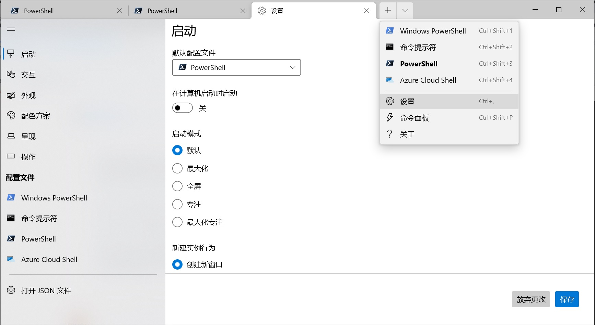

# Windows Terminal + PowerShell + 主题配置

## 安装 Windows terminal
搜索 github “Windows terminal”，或直接访问[链接](https://github.com/microsoft/terminal/releases)，下载安装包。
安装。

## 安装 PowerShell
点击 “Windows + r”，打开 cmd，会提示“尝试新的跨平台 PowerShell”，如下：
```cmd
Windows PowerShell
版权所有（C）Microsoft Corporation，保留所有权利。

尝试新的跨平台 PowerShell https://aka.ms/pscore6

PS C:\Users\Peng Xiao>
```
访问 [https://aka.ms/pscore6](https://aka.ms/pscore6)，下载安装 PowerShell。

打开 Windows terminal，设置默认启动工具，如图：


> `PowerShell` 是新的跨平台终端，Windows 自带的叫 `Windows PowerShell`，不是一个东西。

## 安装扩展
```cmd
rem 安装 oh-my-posh
> Install-Module oh-my-posh -Scope CurrentUser -SkipPublisherCheck

rem 安装
> Install-Module posh-git -Scope CurrentUser

rem 安装
> Install-Module -Name PSReadLine -AllowPrerelease -Scope CurrentUser -Force -SkipPublisherCheck
```

> `Install-Module` 是 PowerShell 的包管理工具

## 设置主题
oh-my-posh 文档：[https://ohmyposh.dev/docs](https://ohmyposh.dev/docs)

编写 profile：
```cmd
> notepad.exe $PROFILE
rem 输入以下内容

Import-Module posh-git
Import-Module oh-my-posh
Set-PoshPrompt -Theme robbyrussel
rem 其中 robbyrussel 为主题名字，可以在 oh-my-posh 中查看自己喜欢的主题：https://ohmyposh.dev/docs/themes
```
