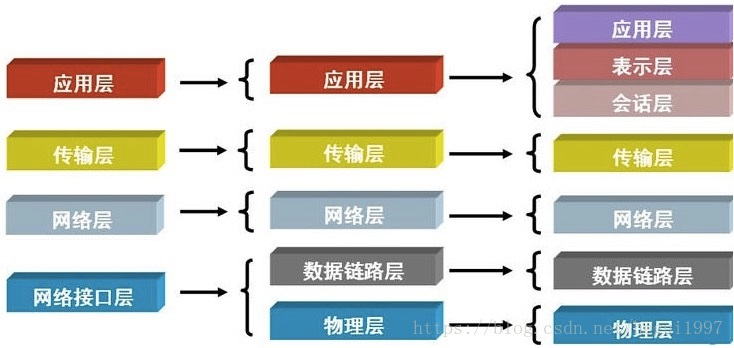

# 网络协议
互联网协议按照功能不同分为osi七层或tcp/ip五层或tcp/ip四层。  

## OSI 七层协议
`Open System Interconnection Reference Model` 开放式系统互联通信参考模型。  
`应、表、会、传、网、数、物`  

- 物理层
    底层物理连接介质。负责发送电信号。高电压对应数字 1，低电压对应数字 0。两个物理层通过光缆、电缆、双绞缆等介质链接。（[wifi的传输方式和物理链路层帧协议](.// todo)）

- 物理链路层  
    定义了电信号的分组方式。

    - “帧”。  
        `ethernet`（以太网） 规定，一组电信号构成一个数据包，叫做“帧”。  
        每一数据帧分成：报头 head（固定18个字节）和数据 data 两部分呢。
        数据包的具体内容：head 长度 + data 长度 = 最短 64 字节，最长 1518 字节，超过最大限制分片发送。
    - mac 地址  
        也叫网卡地址，网络中每台设备唯一的标识。有制造商写入网卡内部。
        48 位（6 字节），12 个 16 进制数，每两个之间用 `:` 分割，前 3 个字节有 IEEE 机构分配给不同厂商，后 3 个字节有厂商自行分配。
    - 广播  
        有了 mac 地址，同一网络中的机器就可以通信了。`ethernet` 采用最原始的**广播**方式进行通信。拆包后发现不是自己的就丢弃，是自己的就响应。

- 网络层  
    > 由来：解决物理链路层大量通信导致性能下降。  
 
    区分多个不同子网 / 广播域的地址，即网络地址。  
    - [IP 协议](./ip.md)  
    - [ARP 协议](./arp.md)
    - 标识地址的方式：
        IP + mac 就能标识全世界范围内独一无二的一台计算机；  
        IP + mac + port 就能标识全世界范围内独一无二的一个基于网络通信的应用软件。
    
- 传输层
    > 由来：网络层区分子网后，以太网找到主机。但是不同台机器上的多个应用程序间还需要`端口`来做区分通信。  
    传输层的功能就是：建立端口到端口的通信。  
    - 端口的范围  
        16 个位，即 2^16（由 [TCP 协议](./tcp.md)报文头端口（PORT）长度限制）。0 ~ 65536，其中 0 ~ 1023 为系统占用端口，1024 ~ 65536 给应用软件用。  
    - [TCP 协议](./tcp.md)
    - [UDP 协议](./udp.md)

### 协议种类

- Webscket
- [LDAP]()
- UDP
- TCP
- HTTP
- HTTPS
- SPDY
- SNMP
- RTMP
- SMTP