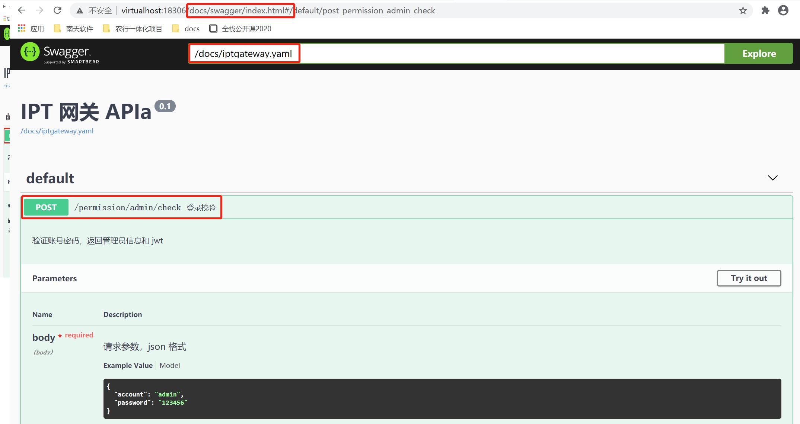

# Swagger

### 安装
```sh
$ npm install -g http-server
$ wget https://github.com/swagger-api/swagger-editor/releases/download/v2.10.4/swagger-editor.zip
$ unzip swagger-editor.zip
$ mv swagger-editor /home/wwwroot/node/
$ http-server swagger-editor -p 8081 # 指定端口
```
报错： http-server command not found
```sh
$ npm root -g # 查看 node_modules 目录
/usr/local/node/lib/node_modules
# 添加 /usr/local/node/lib/node_modules/http-server/bin 目录到环境变量
vi /etc/profile
source /etc/profile
```

[swagger 官网](https://swagger.io/)  


### 安装 `swagger-php` + `swagger-ui`

```sh
# 安装 swagger-php 2.* 版本
$ composer require zircote/swagger-php:2.* --dev
```
> 2.* 版本遵循 `swagger` 注释  
> 3.0 版本遵循 `openapi` 注释，这里安装 2.* 版本  

```sh
# 安装 `swagger-ui`  
$ composer require swagger-ui --dev

# 复制 dist 目录到 public 目录，使其可以访问。可以不加到版本库，而是在 composer.json 中设置 script 脚本，使文档只在 dev 环境中存在
$ cp vendor/swagger-api/swagger-ui/dist public/docs

# 修改 index.html 中的 SwaggerUIBundle url 参数为【public/docs/swagger.yaml】
$ vi public/docs/dist/index.html

# 执行脚本，扫描目录，生成文档
$ php ./vendor/zircote/swagger-php/bin/swagger app/Http/Controller/ -o public/docs/swagger.yaml
```

注释例子
```php
/**
 * 
 * @SWG\Info(title="自动生成 API", version="0.1")
 * @SWG\Definition( definition="permission.admin", example={"id":17013,"account":"zhanghao","name":"姓名","email":"name@email.com","lastIp":"192.168.3.51"} )
 * 
 * @SWG\Post(
 *     path="/permission/admin/check",
 *     summary="登录校验",
 *     description="验证账号密码，返回管理员信息和 jwt",
 *     
 *     @SWG\Parameter(
 *         in="body", 
 *         required=true, 
 *         name="body", 
 *         description="请求参数，json 格式",
 *         @SWG\Schema(
 *             @SWG\Property( property="account", type="string", example="admin" ),
 *             @SWG\Property( property="password", type="string", example="123456" ),
 *         )
 *     ),
 *     @SWG\Response( response="200", description="成功",
 *         @SWG\Schema(
 *             @SWG\Property( property="code", type="number", example=200 ),
 *             @SWG\Property( property="msg", type="string", example="success" ),
 *             @SWG\Property( property="data", type="object",
 *                 @SWG\Property( property="jwt", type="string", example="BwcGAwtYCV9XSwQFWhoHFgZVDFcAAAFFS" ),
 *                 @SWG\Property( property="admin", type="object", example=@SWG\Schema(ref="#/definitions/permission.admin") ),
 *             ),
 *         )
 *     )
 * )
 */
```

访问 host/public/docs/index.html


参照：  
[Swagger-PHP 文档](https://xiaoxiami.gitbook.io/swagger/swagger-php-wen-dang)  
[Thinkphp集成Swagger-PHP](https://www.kancloud.cn/chengguang/swagger-php) [pdf](materials/pdf/Thinkphp集成Swagger-PHP-07241200.pdf)