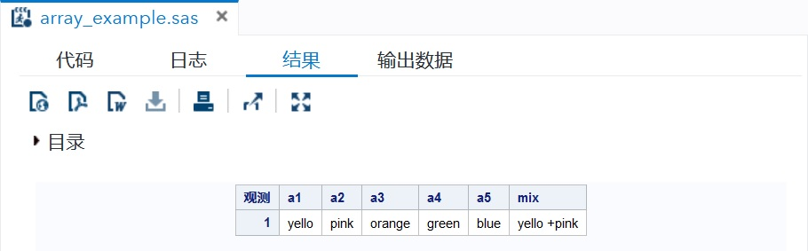

# 数组

语法：
```sas
* ARRAY 数组名(维数说明) (当数组要存储字符值时使用) 数组元素名列表 (初始值表);
ARRAY ARRAY-NAME(SUBSCRIPT) ($) VARIABLE-LIST ARRAY-VALUES
```

### 声明数组
```sas
ARRAY x(3);
/* 数组x的各元素名为x1，x2，x3 */

ARRAY sales(95:97) yr95-yr97 ;
/*
 * sales(95)为yr95，sales(96)为yr96，sales(97)为yr97
 * SAS 可以指定数组下标的界限，95 为下标下界，97为下标上界，连续序号的变量可以使用减号“-”链接
 */

ARRAY tests(*) math chinese english (0, 0, 0);
/* 数组大小由提供的元素列表中的变量个数决定 */

ARRAY table(2,2) x11 x12 x21 x22;
/* 二维数组，使用“,”分开两个下标界声明，table(1,1) => x11，table(1,2) => x12，table(2,1) => x21，table(2,2) => x22 */
```

### 符值

> DATALINES 语句，为数组提供数据，注意格式，数据必须单独一行，结尾必须有“;”。

```sas
DATA array_example;
    INPUT a1 $ a2 $ a3 $ a4 $ a5 $;
    ARRAY colours(5) $ a1-a5;
    mix = a1||'+'||a2;
    DATALINES;
    yello pink orange green blue
    ;
RUN;
PROC PRINT DATA=array_example;
RUN;
```


### OF
当分析数组形式的数组以对数组的整个行执行计算时，使用OF运算符。

```sas
DATA array_of_example;
    INPUT a1 a2 a3 a4;
    ARRAY arr(*) a1-a4;
    arr_sum=SUM(OF arr(*))
    arr_mean=MEAN(OF arr(*))
    arr_min=MIN(OF arr(*))
    DATALINES;
    1 2 3 4
    8 19 980 09
    32 93 53 94
    ;
RUN;
PROC PRITN DATA=array_of_example;
RUN;
```