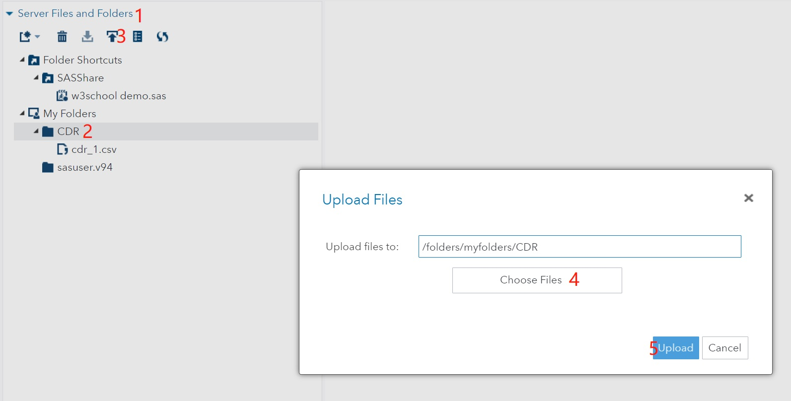
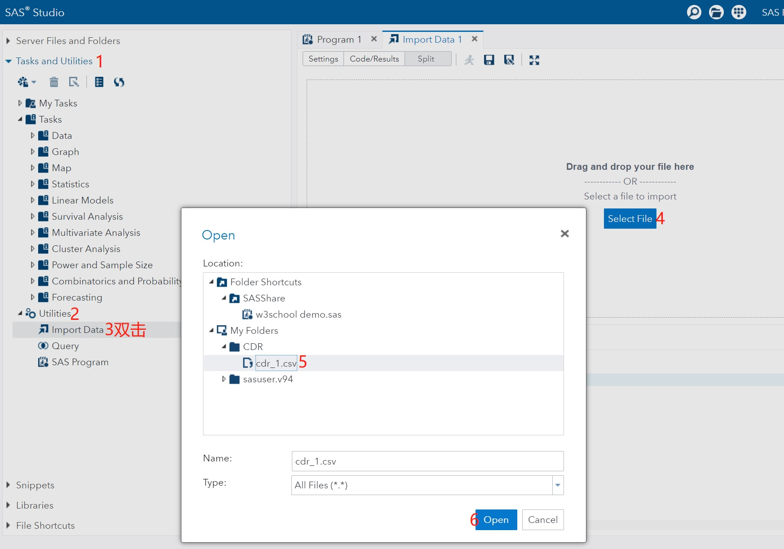

# 数据集

可用于分析的数据，分为 `永久数据集` 和 `临时数据集`。

支持的数据文件类型很多，包括主流的关系型数据库，也可以动态加载远程数据库内容。

### 导入外部数据
在 `Server Files and Folders` 中选择上传，将文件上传到指定目录。  

双击 `Tasks` - > `Utilities` - > `Import Data`，选择导入的数据集，`Run`。

