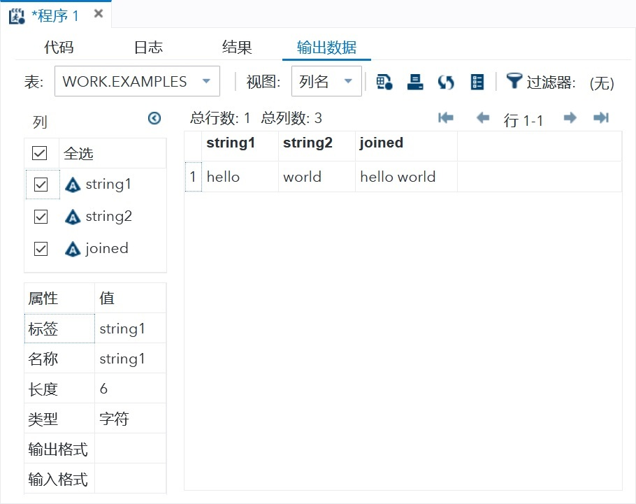

# 变量

<style>
img{
    width: 100%;
    max-width: 600px;
}
</style>

SAS 有三种变量类型，变量声明方式不一样，字符型和日期型需要在变量结尾添加对应格式。  


### 数值变量

> INPUT语句显示变量的声明。

```sas
INPUT VAR1 VAR2 VAR3; 		#Define numeric variables in the data set.
```

### 字符型变量  
变量名称的末尾添加一个带有空格的$。  

```sas
INPUT VAR1 $ VAR2 $ VAR3 $; 	#Define character variables in the data set.
```

> LENGTH关键字用于声明变量而不创建多个观察。

```sas
data examples;
   /*String variables of length 6 and 5 */
    length string1 $ 6 string2 $ 5;
    string1 = 'hello';
    string2 = 'world';

    joined = string1 || string2 ;
run;
```


### 日期变量  
在变量名称末尾带有空格的日期格式变为日期变量。  

```sas
INPUT VAR1 DATE11. VAR2 MMDDYY10. ; #Define date variables in the data set.
```

| 输入日期 | 日期宽度 | INFORMAT |
| ---- | ---- | ---- |
| 03/11/2014 | 10 | mmddyy10. |
| 03/11/14 | 8 | mmddyy8. |
| December 11, 2012 | 20 | worddate20. |
| 14mar2011 | 9 | date9. |
| 14-mar-2011 | 11 | date11. |
| 14-mar-2011 | 15 | anydtdte15. |
