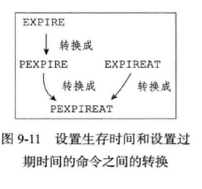

# Redis 过期策略
基于 redis v 4.0.9 版本

## 设置 key 过期时间的命令
```sh
# 将键 key 的生存时间设置为 ttl 秒
redis> EXPlRE <key> <ttl>
# 将键 key 的生存时间设置为 ttl 毫秒
redis> PEXPIRE <key> <ttl>
# 将键 key 的过期时间设置为 timestamp 所指定的秒数时间戳
redis> EXPIREAT <key> <timestamp>
# 将键 key 的过期时间设置为 timestamp 所指定的毫秒数时间戳
redis> PEXPIREAT <key> <timestamp>
# 移除键 key 的过期时间
redis> PERSIST <key>
# 返回键 key 剩余生命周期，秒。-1 为不过期
redis> TTL <key>
# 返回键 key 剩余生命周期，毫秒
redis> PTTL <key>
```
虽然有多种不同单位和不同形式的设置命令，但实际上 `EXPlRE`、`PEXPlRE`、`EXPIREAT` 三个命令都是使用 `PEXPlREAT` 命令来实现的：无论客户端执行的是以上四个命令中的哪一个，经过转换之后，最终的执行效果都和执行`PEXPlREAT` 命令一样。  


## 字符串独有的设置过期时间方式
- `SET` 同时设置过期时间
    ```sh
    redis> SET <key> <value> 100
    ```
- `SETNX` 当使用 Redis 实现锁时，常用 `SETNX`，设置成功后在设置过期时间，但这不是原子操作，会导致失去对锁的持有，存在隐患。
    ```sh
    redis> SETNX <key> <value>
    redis> expire <key> 10
    ```
- Redis 为此做了改进，`2.6.12` 以上版本可以用 set 获取锁。语法：  
    SET key value [EX seconds] [PX milliseconds] [NX|XX]  
    EX seconds：设置失效时长，单位秒  
    PX milliseconds：设置失效时长，单位毫秒  
    NX：key不存在时设置value，成功返回OK，失败返回(nil)  
    XX：key存在时设置value，成功返回OK，失败返回(nil)  
    ```sh
    redis> SET key value EX 100 NX
    ```

## 过期策略
- **`定时删除`**
在设置键的过期时间的同时，创建一个定时器，让定时器在键的过期时间来临时，立即执行对键的删除操作。  
优点：对内存最友好的。可以及时释放键所占用的内存。  
缺点：对 CPU 不友好。特别在过期键比较多的情况下，删除过期键会占用相当一部分 CPU 时间。同时在内存不紧张，CPU 紧张的情况下，将 CPU 用在删除和当前任务不想关的过期键上，无疑会对服务器响应时间和吞吐量造成影响。

- **`惰性删除`**
放任键过期不管，但是每次从键空间中读写键时，都会检查取得的键是否过期。如果过期就删除该删，否则就返回该键。（PS：键空间是一个保存了数据库所有键值对的数据结构）  
优点：对 CPU 最友好。只有在操作的时候进行过期检查，删除的目标仅限于当前需要处理的键，不会在删除其他无关本次操作的过期键上花费任何 CPU 时间。  
缺点：对内存不友好。这个十分容易理解了，键过期了，但因为一直没有被访问到，所以一直保留着（除非手动执行 flushdb 操来于清空当前数据库中的所有 key。），相当于内存泄漏。

- **`定期删除`**
每隔一段时间，程序就对数据库进行检查，删除里面的过期键。至于要删除多少过期键，以及检查多少数据库，则有算法决定。  
该策略是上述两种策略的折中方案，需要通过实际情况，来设置删除操作的执行时长和频率。

- **Redis 使用的过期策略**是：`定期删除` + `惰性删除`。  
Redis 默认每隔 100ms 就随机抽取一些设置了过期时间的 key，检查其是否过期，如果过期就删除。  
假设 Redis 里放了 10w 个 key，都设置了过期时间，你每隔几百毫秒，就检查 10w 个 key，那 Redis 基本上就死了，cpu 负载会很高的，消耗在你的检查过期 key 上了。注意，这里可不是每隔 100ms 就遍历所有的设置过期时间的 key，那样就是一场性能上的灾难。实际上 Redis 是每隔 100ms 随机抽取一些 key 来检查和删除的。  
但是问题是，定期删除可能会导致很多过期 key 到了时间并没有被删除掉，那咋整呢？所以需要配合惰性删除。这就是说，在你获取某个 key 的时候，Redis 会检查一下 ，这个 key 如果设置了过期时间那么是否过期了？如果过期了此时就会删除，不会给你返回任何东西。  
获取 key 的时候，如果此时 key 已经过期，就删除，不会返回任何东西。

## 内存淘汰策略
Redis 的内存淘汰策略是指在 Redis 的用于缓存的内存不足时，怎么处理需要新写入且需要申请额外空间的数据。  
**内存淘汰策略**与**过期策略**是两回事，经常有文章搞混。
- `volatile-lru` 对设置了过期时间的 key 进行 LRU 算法删除（默认）  
- `allkeys-lru` 对所有 key 使用 LRU 算法删除  
- `volatile-lfu` 对设置了过期时间的 key 进行 LFU 算法删除  
- `allkeys-lfu` 对所有 key 使用 LFU 算法删除  
- `volatile-random` 对设置了过期时间的 key 进行随机算法删除  
- `allkeys-random` 对所有 key 使用随机算法删除  
- `volatile-ttl` 删除即将过期的  
- `noeviction` 永不过期，内存不足时直接返回错误  

> 为了方便记忆，大致可以划分两个维度，按照是否设置过期时间分为 `allkeys` 和 `volatitle`，按照淘汰策略分为 `lru`、`lfu`、`random`，可以组合成 6 种策略。再加上两个特殊的。  
> LRU（The Least Recently Used，最近最久未使用算法）  
> LFU（Least Frequently Used ，最近最少使用算法）  

## Rdis 的近似 LRU
Redis 中的 LRU 不是严格意义上的LRU算法实现，是一种近似的 LRU 实现，主要是为了节约内存占用以及提升性能。Redis 的 LRU 是取出 `maxmemory-samples` 配置的数目的 key，然后从中选择一个最近最不经常使用的 key 进行置换，默认的 5。  
[参考](https://www.cnblogs.com/52php/p/6171172.html)、[参考](https://www.cnblogs.com/hongdada/p/10406902.html)

## 相关配置
Redis 影响内存及淘汰策略的配置有 3 个：
```ini
# 最大内存使用量
maxmemory <bytes>
# 内存淘汰策略
maxmemory-policy <淘汰策略>
# LRU 采样数，默认 5，涉及到淘汰时 CPU 的性能消耗
maxmemory-samples <5>
```
还可以通过命令动态调整配置
```sh
CONFIG SET maxmemory 100MB
CONFIG SET maxmemory-samples 5
CONFIG SET maxmemory-policy volatile-lru
```

以下是 Redis 配置文件中注释的淘汰策略。
```ini
# volatile-lru -> Evict using approximated LRU among the keys with an expire set.
# allkeys-lru -> Evict any key using approximated LRU.
# volatile-lfu -> Evict using approximated LFU among the keys with an expire set.
# allkeys-lfu -> Evict any key using approximated LFU.
# volatile-random -> Remove a random key among the ones with an expire set.
# allkeys-random -> Remove a random key, any key.
# volatile-ttl -> Remove the key with the nearest expire time (minor TTL)
# noeviction -> Don't evict anything, just return an error on write operations.
```

## 持久化对过期键的处理
- `RDB`。  
**生成 RDB 文件**时，程序会被数据库中的键进行检查，过期的键不会被保存到新创建的 RDB 文件中。因此数据库中的过期键不会对生成新的 RDB 文件造成影响。  
**载入 RDB 文件**时，
    - 如果服务器以主服务器模式运行，则在载入 RDB 文件时，程序会对文件中保存的键进行检查，过期键不会被载入到数据库中。所以过期键不会对载入 RDB 文件的主服务器造成影响。  
    - 如果服务器以从服务器模式运行，则在载入 RDB 文件时，不论键是否过期都会被载入到数据库中。但由于主从服务器在进行数据同步时，从服务器的数据会被清空。所以一般来说，过期键对载入 RDB 文件的从服务器也不会造成影响。
- `AOF`。  
**AOF 文件写入**时，如果数据库某个过期键还没被删除，那么 AOF 文件不会因为这个过期键而产生任何影响，依旧保留。  
而当过期键被删除后，那么程序会向 AOF 文件追加一条 DEL 命令来显式地记录该键被删除。  
**AOF 重写**时，也会被数据库的键进行检查，已过期的键不会被保存到重写后的 AOF 文件中。因此不会对 AOF 重写造成影响。  
- **复制对过期键的处理**  
当服务器运行在复制模式下，由主服务器来控制从服务器的删除过期键动作，目的是保证主从服务器数据的一致性。  
那到底是怎么控制的呢？  
主服务器删除一个过期键后，会向所有从服务器发送一个 DEL 命令，告诉从服务器删除这个过期键。从服务器接受到命令后，删除过期键。  
**Notice**：从服务器在接收到客户端对过期键的读命令时，依旧会返回该键对应的值给客户端，而不会将其删除。

## Expires字典
// todo


## 参考
https://www.jb51.net/article/174204.htm  
http://lxw1234.com/archives/2017/07/874.htm  
https://www.cnblogs.com/xuliangxing/p/7151812.html  

