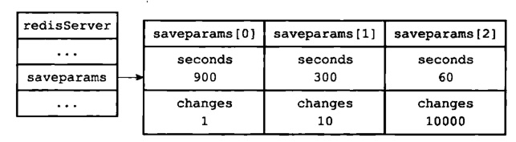

# Redis 持久化总结 RDB

`RDB`，`redis database`。

- 将内存中的数据集快照写入磁盘，恢复时将快照读到内存。
- 两种触发方式
    - 自动触发。配置 `redis.conf` 的 `SNAPSHOTTING` 块下，配置
        ```sh
        # after 900 sec (15 min) if at least 1 key changed, then save
        save 900 1
        # after 300 sec (5 min) if at least 10 key changed, then save
        save 300 10
        # after 60 sec if at least 100000 key changed, then save
        save 60 10000
        ```
    - 手动触发
        - 执行 `SAVE` 命令，该命令会阻塞当前Redis服务器，执行save命令期间，Redis不能处理其他命令，直到RDB过程完成为止。
        - 执行 `BGSAVE` 命令，该命令执行之后立即返回 OK ，然后 Redis fork 出一个新子进程，原来的 Redis 进程(父进程)继续处理客户端请求，而子进程则负责将数据保存到磁盘，然后退出。
- 其他配置
    - `stop-writes-on-bgsave-error` 默认值为 yes。当启用了 `RDB` 且最后一次后台保存数据失败，Redis 是否停止接收数据。这会让用户意识到数据没有正确持久化到磁盘上，否则没有人会注意到灾难（disaster）发生了。当 Redis 重启，重新开始接收数据。
    - `rdbcompression ` 默认值是 yes。在存储快照后，我们还可以让 Redis 使用 [CRC64](../../../basics/algorithm/crc.md) 算法来进行数据校验，但是这样做会增加大约10%的性能消耗，如果希望获取到最大的性能提升，可以关闭此功能。
    - `dbfilename` 默认值为 dump.rdb，设置快照的文件名。
    - `dir` 默认是和当前配置文件保存在同一目录，设置快照文件的存放路径，这个配置项一定是个目录，而不能是文件名。
- 恢复数据，将备份文件 (dump.rdb) 移动到 Redis 安装目录并启动服务即可。
    ```sh
    redis 127.0.0.1:6379> CONFIG GET dir
    1) "dir"
    2) "/usr/local/redis/bin"
    ```
- 定制 `RDB` 持久化
    - 修改上面的配置，注释掉所有的 `save` 行，或添加一个空字符串 `save ""`。
    - 或执行命令
        ```sh
        redis-cli config set save " "
        ```
- 优势：
    - 紧凑（compact），保存某个时间点上的数据集，适用于备份和灾难恢复。
    - 备份时，会 fock 子进程处理，主进程不进行 IO 操作。
    - 恢复速度比 `AOF` 快。
- 劣势：
    - fock 子进程操作属于重量级操作，
    - 二进制格式保存，Redis 版本演化过程中有多个 `RDB` 版本，存在版本兼容问题。
    - 没办法实现实时持久化/秒级持久化，每隔一段时间备份，可能丢失较长时间的数据。
- 自动保存原理  
    Redis 源码中有个服务器状态结构：

    ```c
    struct redisService{
        struct saveparam *saveparams; // 1、记录保存save条件的数组
        long long dirty; // 2、修改计数器
        time_t lastsave; // 3、上一次执行保存的时间
    }
    struct saveparam{
        time_t seconds; // 秒数
        int changes; // 修改数
    };
    ```
    根据前面 redis.conf 配置文件中进行了关于 `save` 的配置，服务器状态中的 saveparam 数组将会是如下图的样子：  
      
    `dirty` 计数器和 `lastsave` 属性。  
    `dirty` 计数器记录距离上一次成功执行 `save` 命令或者 `bgsave` 命令之后，Redis 服务器进行了多少次修改（包括写入、删除、更新等操作）。  
    `lastsave` 属性是一个时间戳，记录上一次成功执行 `save` 命令或者 `bgsave` 命令的时间。  
    通过这两个命令，当服务器成功执行一次修改操作，那么 `dirty` 计数器就会加 1，而 `lastsave` 属性记录上一次执行 `save` 或 `bgsave` 的时间，Redis 服务器还有一个周期性操作函数 `severCron`，默认每隔 100 毫秒就会执行一次，该函数会遍历并检查 `saveparams` 数组中的所有保存条件，只要有一个条件被满足，那么就会执行 `bgsave` 命令。  
    执行完成之后，`dirty` 计数器更新为 0，`lastsave` 也更新为执行命令的完成时间。
- `COW` 机制  
    `Copy On Write` **写时复制**。核心思路：fork 一个子进程，只有在父进程发生写操作修改内存数据时，才会真正分配内存空间，并复制内存中的数据，而且**只复制被修改的内存页中的数据**；  
    Redis 的 `BGSAVE` 命令生成 `RDB` 文件时，本质就是调用 Linux 中的 fork() 命令，Linux 下的 fork() 系统调用实现了 copy-on-wirte 写时复制；  
    fork() 是类 Unix 操作系统上创建线程的主要方法，fork 用于创建子进程（等同于当前进程的副本）；  
    `copy-on-write` 技术，在 fork 出子进程后，与父进程共享内存空间，两者只是虚拟空间不同，但是其对应的物理空间是同一个。
- Redis 中的 `CopyOnWrite`  
    - 结论：`RDB` 持久化时并不会导致内存翻倍，持久化的时
    - Redis 在持久化时，如果是采用 `BGSAVE` 命令或者 `BGREWRITEAOF` 的方式，那 Redis 会 fork 出一个子进程来读取数据，从而写到磁盘中。  
    - 总体来看，Redis 还是读操作比较多。如果子进程存在期间，发生了大量的写操作，那可能就会出现很多的**分页错误（页异常中断 page-fault）**，这样就得耗费不少性能在复制上。  
    - 而在 **rehash 阶段上，写操作是无法避免的**。所以 Redis 在 fork 出子进程之后，**将负载因子阈值提高，尽量减少写操作**，避免不必要的内存写入操作，最大限度地节约内存。
    // todo 这一段不太懂

## 相关阅读
[Linux 的 copy-on-write 机制](../../../basics/computer/linux/cow.md)

## 其他参考
[https://www.cnblogs.com/ysocean/p/9114268.html#_label1_1](https://www.cnblogs.com/ysocean/p/9114268.html#_label1_1)  
