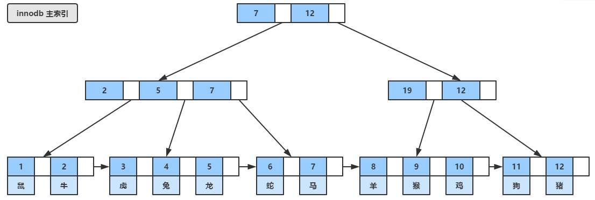
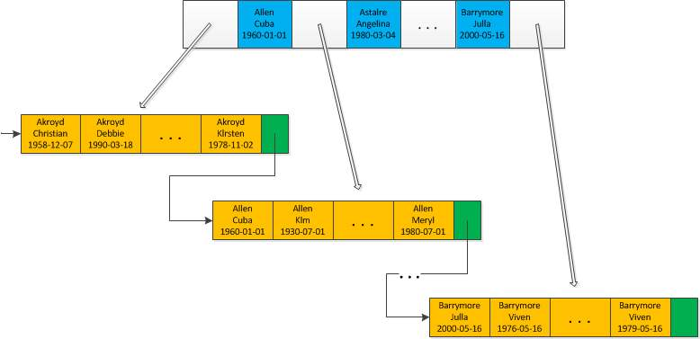

# 索引

## B+tree
[见算法 B+tree] // todo 
> 注意：很多 mysql b+tree 示意图在叶子结点上添加表示下一个叶子节点的指针只有单向的（如本文中的两张图），但根据经验应该是双向指针，需确认。

## 非聚簇索引 和 聚簇索引
MySQL中最常见的两种存储引擎分别是MyISAM和InnoDB，分别实现了非聚集索引（普通索引）和聚集索引。

- 聚集索引： 聚集索引的顺序就决定了数据行的物理存储顺序；所以我们创建的主键索引其实就是聚集索引，如果未定义主键，MYSQL会默认选择非空的唯一索引当作主键，否则会默认生成一个主键。  

> **个人理解：** InnoDB每张表对应两个文件，一个表结构，另一个存储索引和数据，InnoDB使用B+tree的方式存储数据行（主索引），其中结点存储的就是主键。
> - 所以整个数据就是一个聚簇索引的结构。  
> - 所以每张表只有一个聚簇索引；
> - 所以InnoDB引擎无论是否创建索引，都会自动设置一个索引，就是为了构造聚簇索引的结构保存数据。 
> - 所以推荐使用自增整形作为主键。整形体现在比较速度，自增体现在顺序写入磁盘。

- **非聚集索引：** 索引顺序与数据行物理排列顺序无关；

> **个人理解：** 非聚簇索引会按照创建索引的顺序，按值进行排序，并作为索引的结点，非聚簇索引保存的内容是主键。

## 索引的分类
Mysql索引从不同维度可以划分很多种类。
- 主键索引  
- 唯一索引  
- 前缀索引  
    当对字符串进行索引时,如果数据库中该字段有许多的前缀重复就可以使用前缀索引，这样可以大大的节约索引空间,从而提高索引效率；但其缺点也很明显，不能在 `order by` 和 `group by` 中使用。  
    对于 `text`、`blob` 等字段必须使用前缀索引，`VARCHAR` 字段也需要视情况使用前缀索引。  
    索引的选择性：不重复的索引值（也称为基数，cardinality)和数据表的记录总数的比值。  
    ```sql
    > alter table users add index(name(5));
    > insert into users values ('chinadayu'),('chinabinbin');
    > 
    > -- 用到索引也没用，完全没有选择性
    > select * from user where name='dayu'; 
    > 
    > -- 可以使用分组查询，查看不同长度的选择性，保证选择性的同时，占用最小的空间
    > select count(*) as `count`, left(name, 5) as `pref` from `users` group by `pref` order by `count` desc limit 10;
    +-------+----------+
    | count | name     |
    +-------+----------+
    |     2 | china    |
    +-------+----------+
    > select count(*) as `count`,left(name, 6) as `pref` from `users` group by `pref` order by `count` desc limit 10;
    +-------+----------+
    | count | name     |
    +-------+----------+
    |     1 | chinad   |
    |     1 | chinab   |
    +-------+----------+
    rows in set (0.01 sec)

    ```
- 联合索引  
      
    `最左前缀匹配` 原则。  
    Mysql5.6版本发布了 `索引下推` 的原则，主要用于like关键字的查询优化。  
- 二级索引（辅助索引）  
    叶子节点中存储主键值，每次查找数据时，根据索引找到叶子节点中的主键值，根据主键值再到聚簇索引中得到完整的一行记录。  
- 覆盖索引
    MYSQL 如果只通过索引就可以返回查询所需要的数据，就是不是回表查询，否则查到索引数据后还需要回到表中查询数据就是回表查询；

## 索引下推
// todo https://blog.csdn.net/sinat_29774479/article/details/103470244
## 锁和索引的关系
// todo
## `NULL` 的影响
// todo
## `EXPLAIN` 详解
// todo
## 无法使用到索引的情况
// todo https://www.cnblogs.com/xixibaby/p/6409928.html

## 最佳实践
- 不要在NULL值列上使用索引，尽量使用NOT NULL约束列上使用索引。  
- 很少查询的字段不要使用索引。  
- 大数据类型字段不创建索引。  
- 创建合适的长度，在节省空间的同时保证选择性。  
- 尽量使用联合索引。
- 选择性低的字段不适用索引。
- VARCHAR 类型字段最大长度最好设置为 191，因为单列索引默认最大长度是 767，utf8mb4单字符长度是 4，767 / 4 = 191.75。如果使用覆盖索引，可以保证索引完整的存储列的内容。

## 其他注意事项  
- innodb 表的单列索引长度最大字节数是 767 字节，辅助索引超出会被截断，主键索引超出不会截断直接报错导致建表失败。  
- innodb 表的联合索引中每个字段的最大字节数是 767 字节，并且要求联合索引的总长度不超过 3072 字节。  
- 主键索引不允许被截断，辅助索引可以被截断。  
- 设置参数 innodb_large_prefix=ON 只能把单列索引长度扩大到 3072 字节，联合索引总长度的上限不变，仍然是 3072 个字节。  
- 强制使用索引语句：`FORCE INDEX(indexname)`

## 参考资料
[终于有人把MYSQL索引讲清楚了](https://zhuanlan.zhihu.com/p/245095309)
