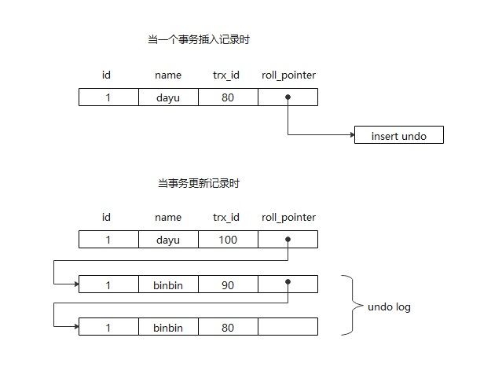

# MVCC

**自己理解的原理，概念和逻辑不一定准确**


## 需要了解的概念
- 事务 ID
- InnoDB 的隐藏列
- undo 回滚日志
- 记录版本链
- Read View

## 事务 ID
每一次事务都会产生一个事务ID。在开启事务并执行一条 sql 语句后，才会生成事务 ID。
```sql
-- 查询当前链接id
SELECT CONNECTION_ID();
-- SOME SQL
-- 查询当前事务id
SELECT TRX_ID FROM INFORMATION_SCHEMA.INNODB_TRX  WHERE TRX_MYSQL_THREAD_ID = CONNECTION_ID();
```

## InnoDB 的隐藏列
InnoDB 储存引擎聚簇索引记录中包含两个隐藏列：`TRX_ID`、`roll_pointer`  
`TRX_ID`：事务ID，每次对某条聚簇索引记录进行改动时，都会把对应的事务ID赋值给 `TRX_id` 隐藏列。  
`roll_pointer`：回滚指针，每次对某条聚簇索引记录进行改动是，都会把旧版本写入到 `undo` 日志中，然后将旧版本的指针保存到 `roll_pointer` 列。  

> 另一个隐藏列是 `raw_id`，当表没有主键或其他非 NULL 唯一索引列时，才会自动添加。因为 InnoDB 引擎需要一个主键来维护**聚簇索引**的结构。

## undo 回滚日志
`undo log` 有两个作用：**提供回滚**和**多个行版本控制**(MVCC)。

此处由两个说法，两种说法有矛盾，需要确认。

**说法一：**  

在数据修改的时候，不仅记录了 `redo`，还记录了相对应的 `undo`，如果因为某些原因导致事务失败或回滚了，可以借助该 `undo` 进行回滚。

`undo log` 和 `redo log` 记录物理日志不一样，它是逻辑日志。可以认为当 `delete` 一条记录时，`undo log` 中会记录一条对应的 `insert` 记录，反之亦然，当 `update` 一条记录时，它记录一条对应相反的 `update` 记录。

当执行 `rollback` 时，就可以从 `undo log` 中的逻辑记录读取到相应的内容并进行回滚。有时候应用到行版本控制的时候，也是通过 `undo log` 来实现的：当读取的某一行被其他事务锁定时，它可以从 `undo log` 中分析出该行记录以前的数据是什么，从而提供该行版本信息，让用户实现非锁定一致性读取。

`undo log` 是采用段(segment)的方式来记录的，每个 `undo` 操作在记录的时候占用一个`undo log segment`。

另外，`undo log` 也会产生 `redo log` ，因为 `undo log` 也要实现持久性保护。

**说法二：**
表示一条记录在插入和更新时 `undo log`的情概况。  
表：user
```sh
mysql> SELECT * FROM user;
+----+------+
| id | name |
+----+------+
| 1  | dayu |
+----+------+
1 row in set (0.01 sec)
```
当存在一个事务执行对记录操作，此条记录的隐藏列情况如下：



## 记录版本链

上面的方法二，表现的就是记录版本链。其中 `roll_pointer` 是只记录旧版本存储位置的指针信息。包括删除语句在内，都不会马上删除旧纪录，而是标记旧记录状态。
> todo SELECT / UPDATE / DELETE 对 `roll_pointer` 和 `undo log` 的操作都不一样，需要在 `undo log` 和 `redo log` 中进行整理。

## Read View

以可重复读级别为例。
当一条查询 sql 执行的时候，获取当前查询开始时，所有**已开始 - 未提交**状态的所有**事务 ID** 和**最大事务 ID**，与当前结果行的事务 ID 进行比较。如果结果行的事务 ID 存在于查询时记录的事务 ID，说明当前结果行是脏读行，需要查询旧版本。再根据当前结果的 `roll_pointer` 查询历史版本，直到历史版本的事务 ID 没有出现在当前查询记录的事务 ID 中，说明找到了这一行应该被读取的状态。