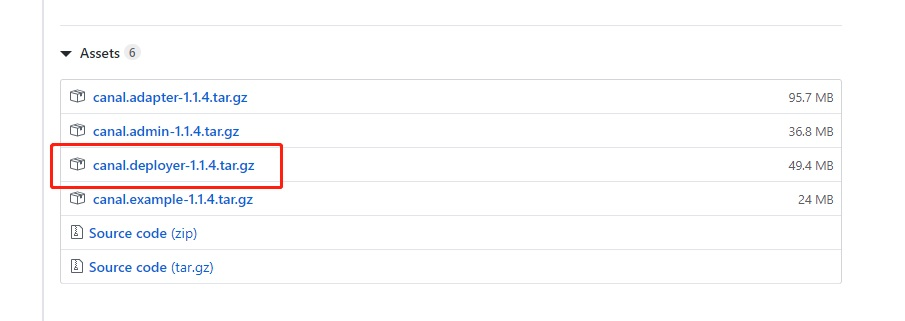

# Canal 安装

## Canal
### 主页
[https://github.com/alibaba/canal/wiki/QuickStart](https://github.com/alibaba/canal/wiki/QuickStart)

### mysql 配置
```
[mysqld]
log-bin=mysql-bin # 开启 binlog
binlog-format=ROW # 选择 ROW 模式
server_id=1 # 配置 MySQL replaction 需要定义，不要和 canal 的 slaveId 重复
```

```
CREATE USER canal IDENTIFIED BY 'canal';  
GRANT SELECT, REPLICATION SLAVE, REPLICATION CLIENT ON *.* TO 'canal'@'%';
-- GRANT ALL PRIVILEGES ON *.* TO 'canal'@'%' ;
FLUSH PRIVILEGES;
```


### 下载

[https://github.com/alibaba/canal/releases](https://github.com/alibaba/canal/releases)

### 开始安装
```
cd /soft
# 下载
wget https://github.com/alibaba/canal/releases/download/canal-1.1.4/canal.deployer-1.1.4.tar.gz
# 解压
mkdir /usr/local/canal
tar zxvf canal.deployer-1.1.4.tar.gz  -C /usr/local/canal/
# 修改配置文件
cd /usr/local/canal/
vi conf/example/instance.properties
# 启动
sh bin/startup.sh
# 关闭
sh bin/stop.sh
```


## canal-admin
### 文档
[https://github.com/alibaba/canal/wiki/QuickStart](https://github.com/alibaba/canal/wiki/QuickStart)

### 开始安装
```
# 下载
cd /soft/
wget https://github.com/alibaba/canal/releases/download/canal-1.1.4/canal.admin-1.1.4.tar.gz
# 解压
mkdir /usr/local/canal-amdin
tar zxvf canal.admin-$version.tar.gz  -C /usr/local/canal-admin
#修改配hi
cd /usr/local/canal-admin
vi conf/application.yml
# 初始化元数据库
mysql -h127.0.0.1 -uroot -p
# 导入初始化SQL
> source /usr/local/canal-admin/conf/canal_manager.sql
# 启动
sh bin/startup.sh
# 关闭
sh bin/stop.sh
```

### 访问
http://127.0.0.1:8089/
默认账号密码：admin/123456

## canal-php
安装
```
composer create-project --prefer-dist laravel/laravel canal "5.8.*"
composer require xingwenge/canal_php
php artisan make:command cacal_consumer
```

## 消费者
```
<?php

namespace App\Console\Commands;

use Com\Alibaba\Otter\Canal\Protocol\RowChange;
use Illuminate\Console\Command;
use Illuminate\Support\Facades\Log;
use xingwenge\canal_php\CanalConnectorFactory;
use xingwenge\canal_php\Fmt;

class cacal_consumer extends Command
{
    /**
     * The name and signature of the console command.
     *
     * @var string
     */
    protected $signature = 'canal:consumer';

    /**
     * The console command description.
     *
     * @var string
     */
    protected $description = 'canal 消费者';

    /**
     * Create a new command instance.
     *
     * @return void
     */
    public function __construct()
    {
        parent::__construct();
    }

    /**
     * Execute the console command.
     *
     * @return mixed
     */
    public function handle()
    {
        Log::info('开启 canal 消费客户端');

        try {
            $client = CanalConnectorFactory::createClient(CanalConnectorFactory::CLIENT_SOCKET);

            $client->connect('virtualhost', 11111);
            $client->checkValid();
            $client->subscribe('1001', 'example', '.*\\..*');

            while (true) {
                $message = $client->get(100);
                if ($entries = $message->getEntries()) {
                    foreach ($message->getEntries() as $entry) {
                        $rowChange = new RowChange();
                        $rowChange->mergeFromString($entry->getStoreValue());
                        
                        $header = $entry->getHeader();
                        $tableName = $header->getTableName();
                        $eventType = $rowChange->getEventType();
                        $sql = $rowChange->getSql();
                        var_dump($eventType);
                        //Fmt::println($entry);
                    }
                }
                sleep(1);
            }

            $client->disConnect();
        } catch (\Exception $e) {
            Log::error('canal 消费客户端异常：[' . $e->getCode() . ']' . $e->getMessage() . PHP_EOL . $e->getFile() . '. ' . $e->getLine() . '.' . PHP_EOL . $e->getTraceAsString());
            $this->error($e->getMessage());
        }
    }
}
```
