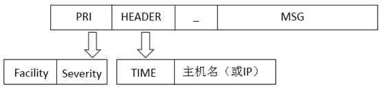

# `syslog` 格式

### `syslog` 标准协议如下图


### 例：
`<30>Oct 9 22:33:20 hlfedora auditd[1787]: The audit daemon is exiting.`   
- `<30>` 是 `PRI` 部分
- `Oct 9 22:33:20 hlfedora` 是 `HEADER` 部分
- `auditd[1787]: The audit daemon is exiting.` 是 `MSG`部分

// todo 补全以下部分
### `PRI` 部分
### `HEADER` 部分
### `MSG` 部分

### `Facility` （设备）
| Facility 可选值 | description | 说明 |
| ---- | ---- | ---- |
| 0 | kernel messages | 内核消息 |
| 1 | user-level messages | 用户消息 |
| 2 | mail system | 邮件系统 |
| 3 | system daemons | 系统守护进程 |
| 4 | security/authorization messages | 安全/授权消息 |
| 5 | messages generated internally by syslogd | syslogd 在内部生成的消息 |
| 6 | line printer subsystem | 行打印机子系统 |
| 7 | network news subsystem | 网络新闻子系统 |
| 8 | UUCP subsystem | UUCP 子系统 |
| 9 | clock daemon | 时钟守护进程 |
| 10 | security/authorization messages | 安全/授权消息 |
| 11 | FTP daemon | FTP 后台程序 |
| 12 | NTP subsystem | NTP 子系统 |
| 13 | log audit | 日志审核 |
| 14 | log alert | 日志警报 |
| 15 | clock daemon | 始终守护程序 |
| 16-23 | local0 - local7 | 本地使用（0 - 7） |

### `Severity` （日志等级）
| Level | 级别 | 说明 |
| ---- | ---- | ---- |
| 0 | Emergency | 紧急 |
| 1 | Alert | 告警 |
| 2 | Critical | 严重 |
| 3 | Error | 错误 |
| 4 | Warning | 警告 |
| 5 | Notice | 通知 |
| 6 | Informational | 信息 |
| 7 | Debug | 调试 |

### 这是几条真实的 `CUCM syslog`
```
<190>May 21 17:19:37 192.168.3.196 402014: May 21 2021 09:19:39.210 UTC :  %UC_AUDITLOG-6-AdministrativeEvent: %[ UserID =devo][ ClientAddress =192.168.3.122][ Severity =6][ EventType =UserAccess][ ResourceAccessed=controlcenterservice2][ EventStatus =Success][ CompulsoryEvent =No][ AuditCategory =AdministrativeEvent][ ComponentID =Cisco CCM Application][ CorrelationID =][ AuditDetails =Attempt to access data was successful.User is authorized to access ControlCenterServices/soapGetStaticServiceList][App ID=Cisco Tomcat][Cluster ID=][Node ID=CUCM196]: Audit Event is generated by this application 
```

```
<187>381: May 21 2021 10:00:20.507 UTC :  %UC_-3-DeviceTLInfo: %[DeviceName=SEP00BF77191D3E][IPv4Address=192.168.3.176][IPv6Address=][CTL_Signature=Not Installed][CTL_TFTP_Server=N/A][ITL_Signature=33 F6 8A F1 E0 5A 9B 22 9B 34 D0 1F 5B 0C 49 ED D9 57 D8 05 ][ITL_TFTP_Server=CUCM196][UNKNOWN_PARAMTYPE:StatusCode=3][App ID=Cisco CallManager][Cluster ID=StandAloneCluster][Node ID=CUCM196]: Trust List Files are updated or installed


<187>382: May 21 2021 10:00:20.513 UTC :  %UC_CALLMANAGER-3-EndPointUnregistered: %[Device name=SEP00BF77191D3E][Device IP address=192.168.3.176][Protocol=SIP][Device type=684][Device description=科员-六楼会议室2-会议室-信阳分行-信阳分行-河南分行][Reason Code=24][IPAddressAttributes=0][LastSignalReceived=SIPRegisterInd][App ID=Cisco CallManager][Cluster ID=StandAloneCluster][Node ID=CUCM196]: An endpoint has unregistered


<187>383: May 21 2021 10:00:20.516 UTC :  %UC_-3-LastOutOfServiceInformation: %[Device Name=SEP00BF77191D3E][Device IPv4 Address=192.168.3.176/24][IPv4 default gateway=192.168.3.1][Device IPv6 Address=][IPv6 default gateway=][Model Number=CP-8851][Neighbor IPv4 Address=192.168.3.196][Neighbor IPv6 Address=][Neighbor Device ID=CUCM196][Neighbor Port ID=eth0][DHCPv4 Status=3][DHCPv6 Status=3][TFTP Configuration Status=1][DNSv4 Status on Unified CM 1=0][DNSv4 Status on Unified CM 2=0][DNSv4 Status on Unified CM 3=0][DNSv6 Status on Unified CM 1=0][DNSv6 Status on Unified CM 2=0][DNSv6 Status on Unified CM 3=0][Voice VLAN=][CUCM IP Address=192.168.3.196][Local Port=50222][Time Stamp=1621591146762][Reason For Out Of Service=115][Last Protocol Event Sent=Sent:REFER sip:192.168.3.196 SIP/2.0  Cseq:1000 REFER CallId:00bf7719-1d3e0068-7f4d5200-00ec21ef@192.168.3.176    ][Last Protocol Event Received=Rcvd:NOTIFY sip:99323@192.168.3.176:50680 SIP/2.0  Cseq:101 NOTIFY CallId:cf8fe380-a716fac-ac1-c403a8c0@192.168.3.196    ][UNKNOWN_PARAMNAME:ReasonForOutOfServiceText=NoEthernetLink][UNKNOWN_PARAMNAME:ActiveInterface=Wired][App ID=Cisco CallManager][Cluster ID=StandAloneCluster][Node ID=CUCM196]:  Information related to the last out-of-service event 


<190>384: May 21 2021 10:00:20.635 UTC :  %UC_CALLMANAGER-6-EndPointRegistered: %[Device name=SEP00BF77191D3E][Device IP address=192.168.3.176][Protocol=SIP][Device type=684][Performance monitor object=2][Device description=科员-六楼会议室2-会议室-信阳分行-信阳分行-河南分行][Load ID=sip88xx.12-5-1ES-11][Associated directory numbers=99322][Device MAC address=00BF77191D3E][IPAddressAttributes=0][ActiveLoadId=sip88xx.12-5-1ES-11.loads][InactiveLoadId=sip88xx.12-0-1SR1-1.loads][App ID=Cisco CallManager][Cluster ID=StandAloneCluster][Node ID=CUCM196]: Endpoint registered

<187>385: May 21 2021 10:00:21.176 UTC :  %UC_-3-DeviceTLInfo: %[DeviceName=SEP00BF77191D3E][IPv4Address=192.168.3.176][IPv6Address=][CTL_Signature=Not Installed][CTL_TFTP_Server=N/A][ITL_Signature=33 F6 8A F1 E0 5A 9B 22 9B 34 D0 1F 5B 0C 49 ED D9 57 D8 05 ][ITL_TFTP_Server=CUCM196][UNKNOWN_PARAMTYPE:StatusCode=3][App ID=Cisco CallManager][Cluster ID=StandAloneCluster][Node ID=CUCM196]: Trust List Files are updated or installed


```

### 参考
[https://blog.csdn.net/jiayanhui2877/article/details/42870325](https://blog.csdn.net/jiayanhui2877/article/details/42870325)   
[https://blog.csdn.net/chdhust/article/details/50989785](https://blog.csdn.net/chdhust/article/details/50989785)   
