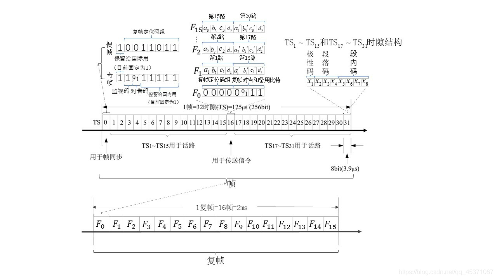

# `VoIP` 基础知识

### 基础知识   

- `ADSL`，早期互联网用户使用 ADSL（Asymmetric Digital Subscriber Line）技术上网，通过猫链接电话线上网。
- `VoIP`（Voice Over IP），承载于 IP 网上的语音通信。可以通过网线打电话。    

以下概念随时间推移产生。    
- `PSTN`（Public Switched Telephone Network），公共交换电话网，现在打电话所使用的电话网络。
- 烽火台是最早的远程通信方式，同一时间只有一个用户可以讲话，即（`半双工`）。
- 每对通话的个体之间都需要 `单独` 的物理线路，如果整个电话网上有10个人，而你想要与另个9个人通话，你家就需要铺设9对电话线。同时整个电话网上就需要 10 x (10-1) / 2 = 45 对电话线。
- 随着电话用户数量增加，`交换机`（`Switch`）的设备诞生了。用户打电话时先连接到管理交换机的接线员，由接线员负责接通到对方的线路。这便是最早的电话`交换网`。
- 电子交换机替代了人工交换机，便出现了现代意义的 `PSTN`。
- 随着通信网络的进一步扩大，便出现了许许多多的交换机。交换机间通过 `中继线`（`Trunk`）相连。有时一个用户与另一个用户通话需要穿越多台交换机。
- `移动电话` 产生后，专门用于对移动电话进行交换的通信网络称 `移动网`。原来的程控交换网则叫 `固定电话网`（`固网`）。

### 时分复用
通过将多个 `信道` 以时分复用的方式合并到一条电路上，可以减少局间中继线的数量。通过将 32 个 64k 的信道利用时分复用合并到一条 2M（ 64k x 32 = 2.048M ，通俗来说就直接叫一个 2M）电路上，称为一个 `E1`（在北美和日本，是 24 个 64k 复用，称为 `T1`，速率是 1.544M）。在 `E1` 中，每一个信道称作一个时隙。其中，除 `0 时隙` 固定传同步时钟，其它 31 个时隙最多可以同时支持 31 路电话（如果使用隨路信令，则使用第 16 时隙传送，这时最多支持 30 路电话）。

- `E1`
    

- **`时隙`**：电路交换汇总信息传送的最小单位。

<small>↑↑↑ 复帧、帧、时隙的关系以及时隙结构。</small>

> `鹏姐` 说：用来传输同步时钟的不是 0 时隙，是 15 时隙。不知道是文档错了，还是 cucm 特殊。需要验证以下，不过，在 cucm 的 syslog 中确实看到了中继的 0 时隙的日志。 

### 局间中继
这些连接交换机（`局`）的 2M 电路就称为局间中继。随着话务量的增加，交换机之间的电路越开越多，目前通常的做法是将 63 个 2M 合并到一个 155M（ 2 x 63 + P = 155，其中 P 是电路复用的开销）的光路（光纤）上。

- `局`，

### 信令
用户设备（如话机）与端局交换机之间，以及交换机与交换机之间需要进行通信。这些通信所包含的信息包括（但不限于）用户、中继线状态，主、被叫号码，中继路由的选择等。我们把这些消息称为信令（Signaling）。

### 七号信令
SS7是目前我国使用的主要的信令方式。 

一次简单的固定电话的通话流程如时序图：   
- 用户 A 摘机，与其相连的 a 交换机根据电压变化检测到 A 摘机后，即送拨号音，同时启动收号程序。
- A 开始拨号，待 a 交换机号码收齐后，即查找路由，发送 IAM（初始地址消息）给 b 交换机。
- b 向话机 B 振铃，同时向 a 发 ACM（地址全消息），a 向 A 送回铃音。
- 这时如果 B 接听电话，则 b 向 a 发送 ANM（应答计费消息），A 与 B 开始通话，同时 a 对 A 计费。
- 通话完毕，任何一方挂机，则本端交换机（如 a）向对端 b 发送 REL（释放消息），b 向 a 回 RLC（确认，释放完成），并向 B 送催挂音（啫啫啫...）。

<pre>
用户A          a交换机        b交换机         用户B
   |             |             |             |
   |   摘机              
   |------------>|             |             |
   |   拨号音              
   |<------------|             |             |
   |   拨号            IAM          振铃    
   |------------>|------------>|------------>|
   |   回铃音          ACM      
   |<------------|<------------|             |
   |   通话            ANM           接听
   |<------------|<------------|<------------|
   |   ...       |             |             |
   |   ...       |             |             |
   |   挂机            REL           送催挂音   
   |------------>|------------>|------------>|
   |                   RLC
   |             |<------------|<------------| 
   |             |             |             |
</pre>

### VoIP 呼叫控制协议

- `SIP`，是 IETF（互联网工程任务组）开发的（RFC3261），它是一种类似 HTTP 的基于文本的协议，很容易实现和扩展，被普遍认为是 VoIP 信令的未来。
- `H323`，是由 ITU-T（国际电信联盟）定义的多媒体信息如何在分组交换网络上承载的建议书。它是一个相当复杂的协议，使用起来很不灵活。
- `MGCP`，略。
- `H.248/MEGACO`，略。

### 其他概念

- `PBX`（Private Branch Exchange），用户级交换机，即公司内部使用的电话业务网络，系统内部分机用户分享一定数量的外线。
- `IPPBX`，基于 IP 的交换机。
- `UCS`，（统一协作系统）。常见 FreeSWITCH、Asterisk 等。